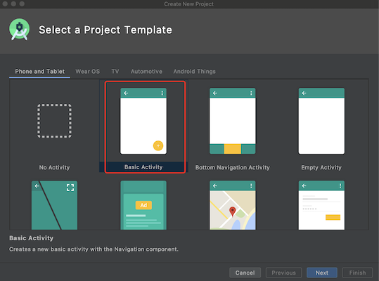
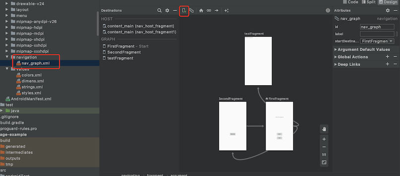

# Navigation_XPage

Google官方Fragment页面框架Navigation和XPage开源框架的使用对比。

## 关于我

[](https://github.com/xuexiangjys)   [](http://blog.csdn.net/xuexiangjys)   [](https://www.jianshu.com/u/6bf605575337)   [](https://juejin.im/user/598feef55188257d592e56ed)   [](https://www.zhihu.com/people/xuexiangjys)

## 简介

* Navigation简介

AndroidJetpack组件。Google官方对它的描述：今天，我们宣布推出Navigation组件，作为构建您的应用内界面的框架，重点是让单 Activity 应用成为首选架构。利用Navigation组件对 Fragment 的原生支持，您可以获得架构组件的所有好处（例如生命周期和 ViewModel），同时让此组件为您处理 FragmentTransaction 的复杂性。此外，Navigation组件还可以让您声明我们为您处理的转场。它可以自动构建正确的“向上”和“返回”行为，包含对深层链接的完整支持，并提供了帮助程序，用于将导航关联到合适的 UI 小部件，例如抽屉式导航栏和底部导航。

* XPage简介

一个非常方便的fragment页面框架，X-Library系列重要组件。设计的初衷是希望能做一个通用的Activity作为壳，Fragment作为页面填充展示，并且能够实现自由的切换和数据交互。

## 特性对比

对比特性 | Navigation | XPage
:-|:-:|:-:
注册方式 | XML注册 | json或者@Page注册
参数传递 ｜ 动态/静态都支持 ｜ 动态/静态都支持
页面切换动画 ｜ 动态支持 ｜ 动态/静态都支持
容器占位数 ｜ 支持多个占位 ｜ 仅支持一个占位
便捷性 ｜ 每次都需要编写navigation导航 ｜ 无需重复性代码，一个@Page注解搞定
功能性 ｜ 强大，支持多种使用方式 ｜ 强大，提供多种常用组件和API
拓展性 ｜ 优秀，方便拓展 ｜ 因为追求便捷性，因此牺牲了部分拓展性
目标 ｜ 去除Activity ｜ 去除Activity
生态 ｜ AndroidJetpack全家桶，Google官方出品 ｜ 生态相对薄弱，但是也有X-Library系列支持

通过上面表格的对比可以看出，这两个框架各有特色。

* Navigation侧重拓展性，适合中大型项目，方便项目的维护和拓展。

* XPage侧重便捷性，适合中小型项目，快速开发，尤其适合新手、学生党和自由开发等独立开发者。

## 使用对比

> 以下我仅从集成和页面跳转两个方面进行简单的使用比较，更多使用内容可以参阅本项目源码。

### 集成

* Navigation

由于是Google出品，所有非常方便，只需要你创建项目(New Project)的时候，选择"Basic Activity"的选项，工程会自动帮你增加Navigation的依赖。如下图:



如果你不想创建新的项目，也很简单，只需要在项目中增加如下依赖：

```
dependencies {
    ...
    implementation 'androidx.navigation:navigation-fragment:2.3.0'
    implementation 'androidx.navigation:navigation-ui:2.3.0'
}
```

* XPage

XPage的集成相对比较麻烦，不过相对也提供了一个模版工程，直接集成了XPage，拿到手就可以用了。

* [简化版的Android空壳模版工程](https://github.com/xuexiangjys/TemplateSimpleProject)
* [Android空壳模版工程](https://github.com/xuexiangjys/TemplateAppProject)


如果你想集成到自己的项目中，可以参考[XPage集成指南](https://github.com/xuexiangjys/XPage/wiki/集成指南)。


### 页面跳转

> 页面跳转的话，XPage就相对简单多了。

* Navigation

1.在res/navigation/中创建navigation导航图。



2.在Activity的布局中增加Fragment占位容器。下面是使用`NavHostFragment`进行占位。

```
<fragment
    android:id="@+id/nav_host_fragment"
    android:name="androidx.navigation.fragment.NavHostFragment"
    android:layout_width="0dp"
    android:layout_height="0dp"
    app:defaultNavHost="true"
    app:navGraph="@navigation/nav_graph" />
```

3.使用`NavController`进行页面导航。

```
NavHostFragment.findNavController(FirstFragment.this)
        .navigate(R.id.action_FirstFragment_to_SecondFragment);
```

* XPage

1.随便创建一个类并继承`XPageFragment`,然后在类上使用@Page进行注解

```
@Page
public class TestFragment extends XPageFragment {

...

}
```

2.然后在任意继承了`XPageActivity`或者`XPageFragment`类中使用`openPage`即可。

```
// 使用类名打开
openPage(TestFragment.class);
// 使用页面标识符打开
openPage("TestFragment");
```


